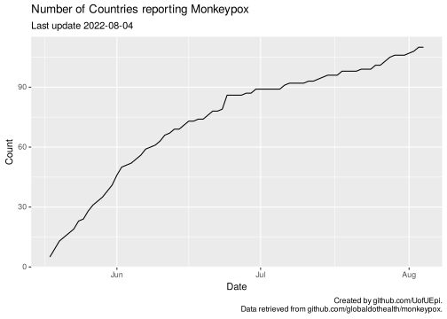
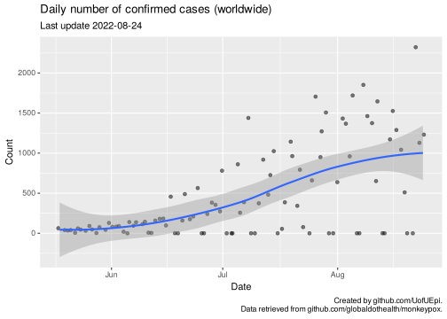
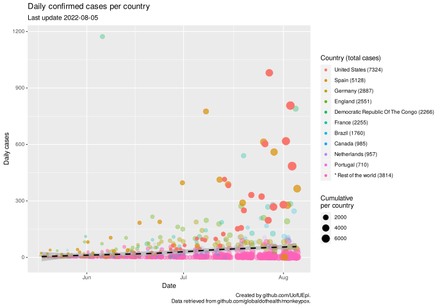

# Monkeypox 

This report is automatically compiled using data from
[Global.health](https://global.health). The original data is retrieved
from [this repository](https://github.com/globaldothealth/monkeypox).

## Cases per country

<!-- -->

<!-- -->

## Cases total

<!-- -->

<!-- -->

<!-- -->
